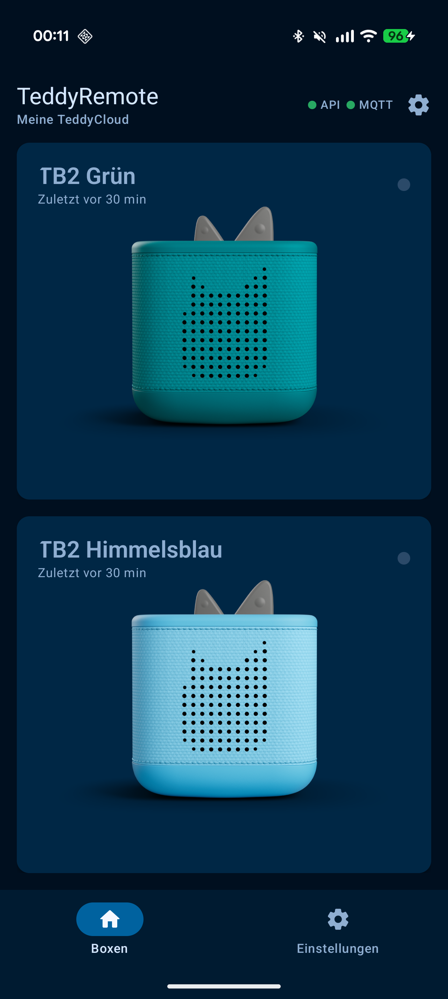
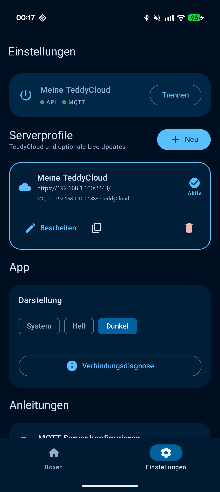
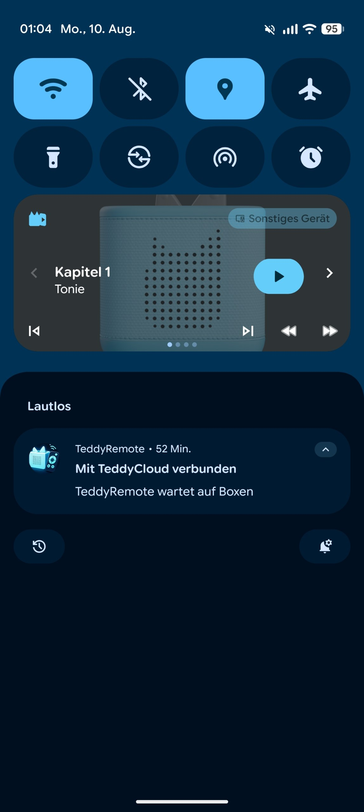
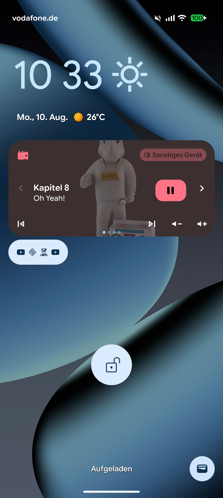

# TeddyRemote

TeddyRemote ist eine moderne native Android-App zur Fernsteuerung von Toniebox-2-Geräten über TeddyCloud. Die App gibt selbst kein Audio wieder: Sie zeigt den aktuellen Zustand der Boxen an und sendet Steuerbefehle über die TeddyCloud-API.

## Funktionsumfang

- adaptive TB2-Karten mit Boxname, Boxbild, Onlinezustand und „Zuletzt gesehen“
- Akku-, Kopfhörer- und sekundengenauer Bedtime-Status
- physischer Tonie mit Bild, RUID, Titel, Kapitel und Laufzeit
- Previous, Play/Pause, Next und Kapitelauswahl
- Lautstärkeregelung von 0 bis 10
- Bedtime starten, neu setzen oder abbrechen, die Bedtime-Ringhelligkeit steuern sowie bestätigt zweistufig schlafen legen
- optionale Ringhelligkeit
- Android-Mediensteuerung für aktive TB2 – ohne lokale Audiowiedergabe
- mehrere speicherbare TeddyCloud-/MQTT-Verbindungsprofile
- automatischer Reconnect mit begrenzbarem exponentiellem Backoff
- Livezustände über einen externen MQTT-Broker; API-Polling als Fallback
- lokaler Cache für Box- und Toniebilder
- Light-, Dark- und System-Theme

TeddyRemote unterstützt ausschließlich Toniebox 2. TB1-Geräte werden bewusst nicht angezeigt.

## Screenshots
| Boxübersicht | Einstellungen |
|---|---|
|  |  |
| Player | Sperrbildschirm |
|  |  |

## Voraussetzungen

- Android 10 oder neuer (`minSdk 29`)
- TeddyCloud mit TB2-Live-State- und Control-API
- Netzwerkzugriff des Android-Geräts auf TeddyCloud
- optional: ein externer MQTT-3.1.1-Broker für schnelle Live-Updates

Der unter **MQTT und Home Assistant** konfigurierte TeddyCloud-MQTT-Client veröffentlicht Zustände an den externen Broker. Der interne ICI-MQTT-Server (`mqtt_server.*`) ist dafür ausdrücklich nicht vorgesehen.

TeddyRemote abonniert:

```text
<prefix>/status
<prefix>/box/+/+
```

Ohne MQTT bleibt die App über angepasstes API-Polling nutzbar. MQTT reduziert die Verzögerung und vermeidet unnötige Abfragen.

## Verbindung einrichten

Beim ersten Start wird ein Serverprofil angelegt. Erforderlich ist mindestens die TeddyCloud-Basis-URL, zum Beispiel:

```text
https://192.168.1.100:8443/
```

`192.168.1.100` ist nur eine neutrale Beispieladresse und muss durch die tatsächliche Adresse des eigenen TeddyCloud-Hosts ersetzt werden.

Ein Profil kann zusätzlich Host, Port, Prefix, TLS, Benutzername und Passwort des externen MQTT-Brokers enthalten. API und MQTT lassen sich im Profildialog getrennt prüfen.

Die App enthält unter **Einstellungen → Anleitungen → MQTT-Server konfigurieren** eine lokale HTML-Anleitung für einen kleinen TLS-gesicherten Mosquitto-Broker. Sie wird direkt im installierten Browser geöffnet und benötigt keine Internetverbindung.

## Projektstruktur

```text
app/src/main/java/de/teddycloud/teddyremote/
├── data/        Profile und verschlüsselte Zugangsdaten
├── model/       Verbindungs-, API- und UI-Modelle
├── mqtt/        MQTT-Verbindung und Topic-Auswertung
├── network/     TeddyCloud-API und TLS-Fingerprint-Pinning
├── repository/  Zustandszusammenführung, Polling und Reconnect
├── service/     Foreground-Service und Android-MediaSessions
└── ui/          Jetpack-Compose-Oberfläche
```

Die App verwendet Kotlin, Jetpack Compose, Material 3, Retrofit/OkHttp, Kotlin Serialization, HiveMQ MQTT Client, DataStore, Coroutines/StateFlow und Coil.

## Lokaler Build

Benötigt werden:

- JDK 17
- Android SDK 36
- Android Build Tools und Platform Tools

PowerShell:

```powershell
$env:JAVA_HOME='C:\Program Files\Eclipse Adoptium\jdk-17.0.19.10-hotspot'
./gradlew.bat test
./gradlew.bat lint
./gradlew.bat assembleRelease
```

Die APK entsteht unter:

```text
app/build/outputs/apk/release/app-release.apk
```

## Release-Signatur

Die Signaturdaten liegen absichtlich außerhalb des Projekts unter:

```text
%USERPROFILE%\.teddyremote\signing.properties
```

Ein lokaler Keystore kann vorbereitet werden mit:

```powershell
./scripts/prepare-signing.ps1
```

Fehlt die externe Release-Konfiguration, signiert Gradle den lokalen Release-Build zu Entwicklungszwecken mit der Debug-Signatur. Keystore und Passwörter dürfen nicht in das Projekt übernommen werden.

## Sicherheit und Datenschutz

- MQTT-Passwörter werden per AES-GCM mit einem nicht exportierbaren Android-Keystore-Schlüssel verschlüsselt.
- Selbst signierte API- und MQTT-Zertifikate müssen anhand ihres SHA-256-Fingerprints bestätigt werden.
- Bestätigte Fingerprints werden pro Profil gepinnt. Ein Zertifikatswechsel blockiert die Verbindung bis zur erneuten Bestätigung.
- HTTP bleibt für lokale Testsysteme möglich, wird aber deutlich als unverschlüsselt markiert.
- Zugangsdaten und Zertifikatsinhalte werden nicht protokolliert.
- Die App besitzt keine Audio-Engine, fordert keinen Audiofokus an und spielt keine lokalen Audiodateien ab.

## Entwicklungsstatus

TeddyRemote befindet sich in aktiver Entwicklung. Die App setzt die im verwendeten TeddyCloud-TB2-Branch bereitgestellten Zustands- und Steuerendpunkte voraus; andere TeddyCloud-Versionen können noch nicht alle angezeigten Funktionen liefern.

